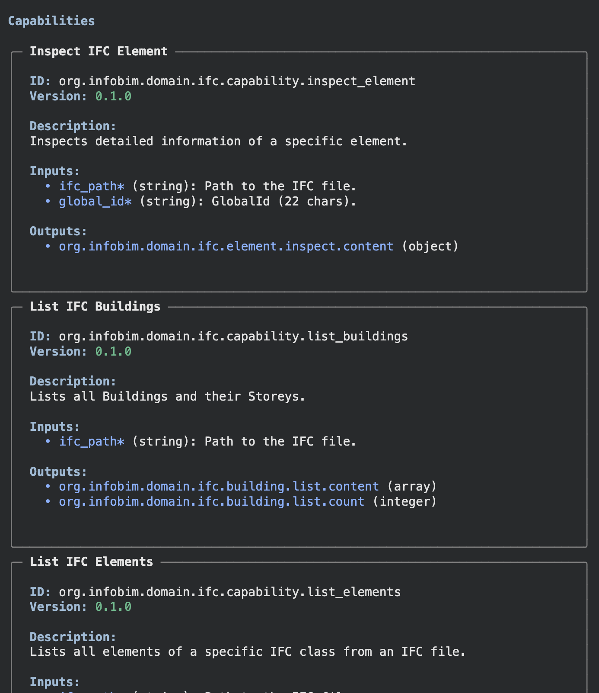
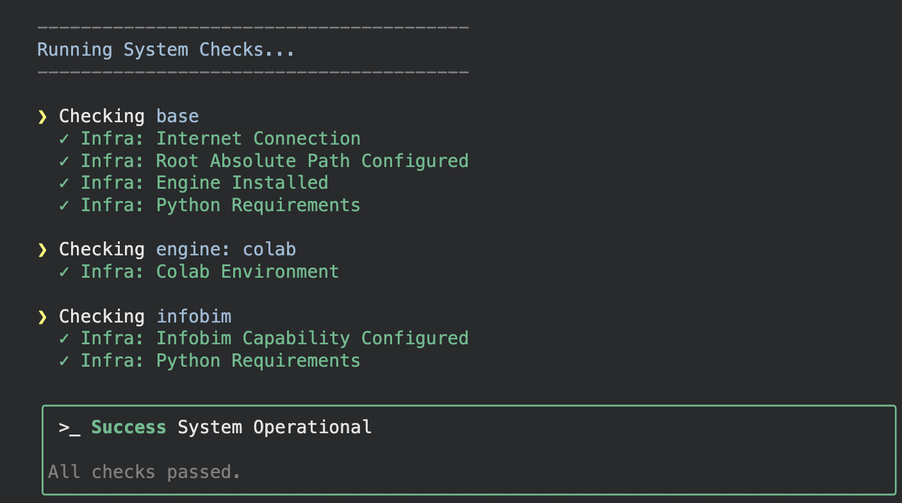

# InfoBIM Core

<div align="center">
<pre>
  _____        __      ____ _____ __  __
 |_   _|      / _|    |  _ \_   _|  \/  |
   | |  _ __ | |_ ___ | |_) || | | \  / |
   | | | '_ \|  _/ _ \|  _ < | | | |\/| |
  _| |_| | | | || (_) | |_) || |_| |  | |
 |_____|_| |_|_| \___/|____/_____|_|  |_|
</pre>
</div>


### The Capability Engine for BIM Automation

> **Turn your BIM scripts into standardized, agent-ready capabilities.**

**InfoBIM IFC** is a modular runtime environment for Engineering Automation. It decouples the **execution logic** (how to run scripts, handle dependencies, manage Docker) from the **business logic** (validating pipes, counting doors, auditing models).

Whether you are a human running commands in the terminal or an **AI Agent** planning a complex workflow, InfoBIM provides the standard interface to interact with BIM data.

---

## Overview

- **CLI**: `infobim | check | run | list`
- **Engines**: supports `venv` and `colab` via OntoBDC configuration
- **IFC Support**: built on top of IfcOpenShell for openBIM workflows

---

## 🚀 Quick Start

### 1. Install

InfoBIM is designed to require as little setup as possible to get started. You can currently use InfoBIM locally (Python venv) or in Google Colab, depending on your needs.

#### Local Installation
Local installation requires Python 3.10+ with pip and venv available. To create and activate a virtual environment, go to the project directory and run:
```bash
python -m venv .venv
source .venv/bin/activate
```
Then:
```bash
pip install infobim
```

To verify the installation, run:
```bash
infobim --version
```

And, welcome to InfoBIM world!

#### Google Colab Mode (Optimized for Notebooks)
All current InfoBIM features are available in Colab. You can check the example notebook here:

[Google Colab Notebook](https://colab.research.google.com/github/infobim/infobim-stack/blob/main/wip/colab.ipynb)

---

### 2. Run a Capability

Capabilities are the core of InfoBIM. They define the actions that can be performed on IFC models. When you execute a capability, InfoBIM will:

- Check whether the capability is available in the current environment.
- Execute the capability with the provided parameters.
- Return the execution results.

For this reason, only capabilities whose required parameters are satisfied are shown in the runtime menu. When you run:
```bash
infobim run
```

Interactive mode (terminal menu) shows a UI to select an available capability. Most InfoBIM capabilities require an IFC file path, so you will usually pass `--ifc-path` when running by ID.

---
### 3. List available capabilities

Lists all capabilities discovered in the current environment (after initialization and checks).
```bash
infobim list
```


---

### 4. System Health & Maintenance
InfoBIM includes self-diagnostic tools to ensure your environment is correctly configured.

**Run System Check:**
Verifies if all dependencies (Python, Git, Venv, Docker) and project structures are in place.
```bash
./infobim check
```

**Auto-Repair:**
If a check fails, you can try the repair mode, which attempts to fix common issues automatically (e.g., recreating venv, installing missing requirements).
```bash
./infobim check --repair
```


---

## 🧩 IFC Capabilities

A **Capability** is the atomic unit of work in InfoBIM. It wraps your Python scripts with:
1.  **Metadata**: Name, version, description.
2.  **Schema**: Formal definition of Inputs (arguments) and Outputs (return data).
3.  **Docs**: Embedded documentation for both humans and LLMs.

Thus, InfoBIM IFC acts as a lightweight runtime layer for BIM automation, turning scripts into discoverable and repeatable capabilities.

*   **Runtime**: Handles the environment (Python, Docker, IFCOpenShell).
*   **Registry**: Discovers and registers available Capabilities.
*   **Interfaces**:
    *   **CLI**: Direct execution (`./infobim run --id <capability_id> --ifc-path ./path/to/model.ifc`).
    *   **TUI**: Interactive Text User Interface (`./infobim run --ifc-path ./path/to/model.ifc`).

Examples:

| ID | Name | Description | Key parameters |
|---|---|---|---|
| `org.infobim.domain.ifc.capability.list_elements` | List IFC Elements | Lists IFC elements by IFC class | `--ifc-path`, `--ifc-class`, `--start`, `--limit` |
| `org.infobim.domain.ifc.capability.list_property_sets` | List IFC Property Sets | Lists Psets and properties of an element | `--ifc-path`, `--global-id` |
| `org.infobim.domain.ifc.capability.inspect_element` | Inspect IFC Element | Inspects attributes and properties of an element | `--ifc-path`, `--global-id` |
| `org.infobim.domain.ifc.capability.list_buildings` | List IFC Buildings | Lists IfcBuildings and their Storeys | `--ifc-path` |

```bash
infobim run --id org.infobim.domain.ifc.capability.list_buildings --ifc-path ./path/to/model.ifc
infobim run --id org.infobim.domain.ifc.capability.list_property_sets --ifc-path ./path/to/model.ifc --global-id '2T$yW1JQv9FQ0kqP8m9qXb'
infobim run --id org.infobim.domain.ifc.capability.inspect_element --ifc-path ./path/to/model.ifc --global-id '2T$yW1JQv9FQ0kqP8m9qXb'
```

---

## 🤖 For AI Agents

InfoBIM is **Agent-First**.
*   **Discovery**: `infobim list --json` provides the tool definitions (compatible with OpenAI/Claude function calling).
*   **Deterministic Execution**: Agents don't "guess" geometry; they call Capabilities that return precise data.
*   **Structured Output**: All capabilities return strict JSON data, making it easy for LLMs to reason about the results.

---

## 📄 License

This project is part of the **InfoBIM Community**.
Licensed under **Apache 2.0**.

<div align="center">
  <b>Proudly developed in Brazil 🇧🇷, so far</b>
</div>